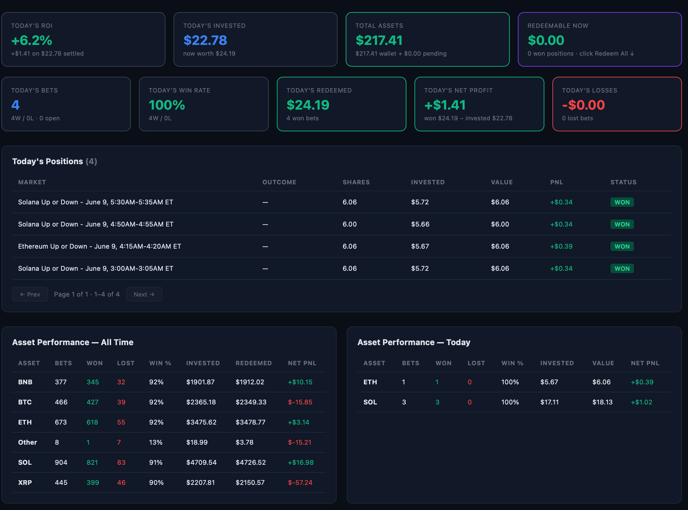
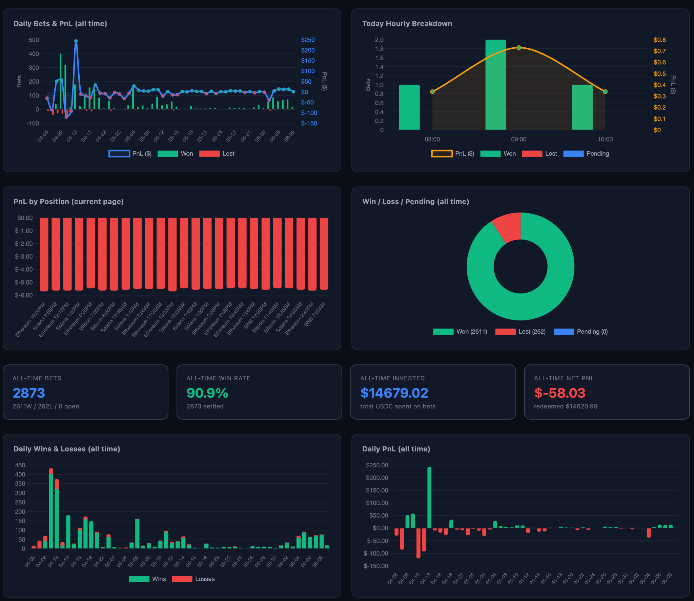
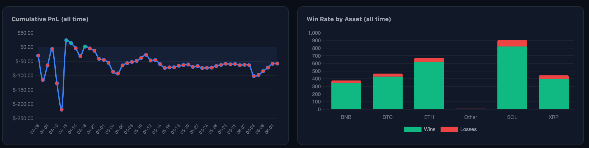

# Polymarket Dashboard

A self-hosted Go dashboard for tracking your [Polymarket](https://polymarket.com) trading activity in real time. Supports both legacy V1 (USDC.e) and V2 (pUSD) — the April 2026 CLOB V2 migration is handled transparently by merging data from the EOA and the V2 proxy wallet.

 

## Screenshots





## Features

- **Wallet balances** — pUSD, USDC.e, native USDC, POL read directly from Polygon RPC
- **Positions** — open and resolved markets across V1 (EOA) and V2 (proxy), merged in one view
- **Today's performance** — per-market BUY / REDEEM activity for the current trading day (ET), with WON / LOST / PENDING status
- **All-time stats** — daily PnL, win rate, asset breakdown (BTC / ETH / SOL / BNB / XRP / Other)
- **Trade history** — paginated CLOB trade log with market titles
- **Real profit** — separates wallet liquidity from redeemable shares and from unrealized PnL
- **Auto-refresh** every 30s, with short-lived in-memory caching so a refresh hits the data API once, not seven times

## Stack

- **Backend**: Go (`net/http` standard library, no framework), `godotenv` for env loading, `go-ethereum/crypto` for ECDSA signing
- **Frontend**: single static `index.html` with vanilla JS and [Chart.js](https://www.chartjs.org/)
- **Data sources**:
  - `data-api.polymarket.com` — positions, activity (trades + redemptions)
  - `clob.polymarket.com` — authenticated trade history (HMAC-SHA256)
  - `polygon-bor-rpc.publicnode.com` — on-chain ERC-20 balances

## Setup

```bash
git clone https://github.com/indover/polymarket-dashboard.git
cd polymarket-dashboard
cp .env.example .env
# fill in your values (see below)
go run .
```

Open <http://localhost:8080>.

### Required env vars

| Variable | What it is | Where to get it |
|---|---|---|
| `POLYMARKET_ADDRESS` | Your EOA (signer) wallet — holds USDC.e / native USDC | Your MetaMask / signer address |
| `POLYMARKET_PROXY_ADDRESS` | Your V2 Polymarket proxy — holds pUSD and owns V2 trades | Find it on PolygonScan: look at any V2 trade tx, find the address that receives pUSD in the ERC-20 transfer trace |
| `CLOB_API_KEY` / `CLOB_SECRET` / `CLOB_PASSPHRASE` | CLOB API credentials | Auto-created on first login at <https://polymarket.com>; export from the dev console or generate via the SDK |

`POLYMARKET_PRIVATE_KEY`, `RELAYER_API_KEY*` are optional — only needed if you re-enable the (currently commented-out) redemption path. Polymarket V2 auto-redeems winning positions, so you usually don't need them.

## Endpoints

| Path | What it returns |
|---|---|
| `/` | The HTML dashboard |
| `/api/balance` | `{ usdc, usdce, pusd, pol }` |
| `/api/positions` | All positions across EOA + proxy |
| `/api/trades` | CLOB trade history (paginated server-side) |
| `/api/today-positions` | Markets bought or redeemed today (ET) |
| `/api/all-time-activity` | Daily and per-asset PnL aggregates (cached 30s) |
| `/api/real-profit` | Wallet + redeemable + unrealized PnL summary |
| `/api/summary` | Position / trade / balance roll-up |

## How V1 + V2 merging works

After Polymarket's April 28, 2026 V2 migration, your USDC.e balance was wrapped into **pUSD** held on a **separate proxy wallet** (a Safe-style contract derived from your EOA). New trades are recorded against that proxy address, not the EOA.

Rather than pick one address, the dashboard queries **both** in parallel and merges:

- `fetchPositionsAll(cfg)` — `goroutines` against EOA and proxy, results concatenated
- `fetchActivityPageAll(cfg, type, limit, offset)` — same, for TRADE and REDEEM streams
- `fetchBalanceCombined(cfg)` — USDC.e / USDC / POL from the EOA, pUSD from the proxy

This way, your historical V1 positions stay visible alongside live V2 activity.

## License

MIT
